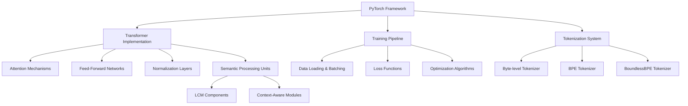
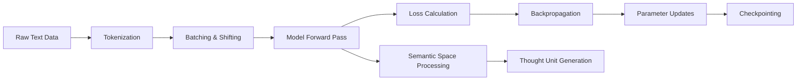

# LLM from Scratch — Hands-On Curriculum (PyTorch) - Design Document

## 1. Overview

This document outlines the design and implementation plan for a comprehensive curriculum to build a Large Language Model from scratch using PyTorch. The curriculum is structured in 9 progressive parts, starting with foundational concepts and gradually building up to advanced techniques like Mixture-of-Experts and Reinforcement Learning with Human Feedback (RLHF).

The goal is to provide hands-on experience with all major components of modern LLMs, including:

- Core Transformer architecture
- Training pipelines
- Modern architectural improvements
- Scaling techniques
- Advanced training paradigms (SFT, RLHF)

### 1.1 Key Features

- **Large Concept Models (LCMs)**: Processing on semantic units using SONAR embedding space
- **Context-Aware Semantic Processing**: Dynamic context vectors with attention modulation
- **Semantic Decoding**: Processing in semantic space using "thoughts" as fundamental units
- **Hierarchical Language Models**: Leveraging hyperbolic space for hierarchical structures
- **Alternative Tokenization**: BoundlessBPE and Byte Latent Transformer approaches
- **Efficiency Optimization**: Quantization, compression, and optimized training techniques

### 1.2 Implementation Environment

- **Primary Framework**: PyTorch with CUDA support
- **Experimentation Platform**: Jupyter Notebooks for interactive, uncensored exploration
- **Visualization Tools**: TensorBoard, wandb, custom plotting utilities
- **Performance Profiling**: PyTorch Profiler, memory tracking tools

## 2. Curriculum Structure

### Part 0 — Foundations & Mindset

- Understanding the LLM training pipeline (pretraining → finetuning → alignment)
- Hardware & software environment setup (PyTorch, CUDA/Mac, mixed precision, profiling tools)

### Part 1 — Core Transformer Architecture

- Positional embeddings (absolute learned vs. sinusoidal)
- Self-attention from first principles
- Single attention head implementation
- Multi-head attention
- Feed-forward networks (MLP layers)
- Residual connections & LayerNorm
- Full Transformer block

### Part 2 — Training a Tiny LLM

- Byte-level tokenization
- Dataset batching & shifting for next-token prediction
- Cross-entropy loss & label shifting
- Training loop implementation
- Sampling techniques (temperature, top-k, top-p)
- Validation evaluation

### Part 3 — Modernizing the Architecture

- RMSNorm implementation
- RoPE (Rotary Positional Embeddings)
- SwiGLU activations in MLP
- KV cache for faster inference
- Sliding-window attention & attention sink
- Rolling buffer KV cache for streaming

### Part 4 — Scaling Up

- BPE tokenization
- Gradient accumulation & mixed precision
- Learning rate schedules & warmup
- Checkpointing & resuming
- Logging & visualization

### Part 5 — Mixture-of-Experts (MoE)

- MoE theory (expert routing, gating networks, load balancing)
- MoE layer implementation
- Hybrid architectures (MoE + dense layers)

### Part 6 — Supervised Fine-Tuning (SFT)

- Instruction dataset formatting
- Causal LM loss with masked labels
- Curriculum learning for instruction data
- Output evaluation against gold responses

### Part 7 — Reward Modeling

- Preference datasets (pairwise rankings)
- Reward model architecture
- Loss functions (Bradley–Terry, margin ranking)
- Reward shaping sanity checks

### Part 8 — RLHF with PPO

- Policy network with value head
- Reward signal from reward model
- PPO objective with KL penalty
- Complete training loop
- Logging & stability techniques

### Part 9 — RLHF with GRPO

- Group-relative baseline approach
- Advantage calculation
- Policy-only objective
- Explicit KL regularization
- Modified training loop with multiple completions

### Part 10 — Advanced Semantic Processing

- Large Concept Models (LCMs) implementation
- Context-aware semantic processing
- Semantic decoding with thought units
- Hyperbolic space representations
- Alternative tokenization (BoundlessBPE, Byte Latent Transformers)

## 3. Technical Architecture

### 3.1 Core Components

### 3.2 Data Flow Architecture

### 3.3 Advanced Architecture Components

#### Large Concept Models (LCMs)

- **SONAR Embedding Space**: Utilizing multilingual sentence embeddings for semantic processing
- **Concept Units**: Fundamental semantic building blocks replacing traditional tokens
- **Semantic Attention**: Context-modulated attention mechanisms for concept processing

#### Hierarchical Language Models

- **Hyperbolic Geometry**: Poincaré ball model for representing tree-like structures
- **Hierarchical Attention**: Multi-scale attention mechanisms
- **Tree-Structured Representations**: Embedding syntactic and semantic hierarchies

## 4. Implementation Plan

### 4.1 Environment Setup

- PyTorch installation with CUDA support
- Mixed precision training configuration
- Profiling tools for performance optimization
- Visualization tools (TensorBoard/wandb)
- Jupyter Notebook environment for uncensored experimentation
- SONAR embedding model integration
- Hyperbolic geometry libraries

### 4.2 Module Implementation Order

1. Basic Transformer components (attention, MLP, normalization)
2. Tokenization systems (byte-level, BPE, BoundlessBPE)
3. Training loop infrastructure
4. Modern architectural improvements (RMSNorm, RoPE, SwiGLU)
5. Scaling mechanisms (gradient accumulation, mixed precision)
6. Advanced training techniques (SFT, RM, RLHF)
7. Semantic processing units and LCM implementation
8. Hierarchical language models with hyperbolic embeddings
9. Efficiency optimizations (quantization, compression)
10. Advanced semantic processing and alternative tokenization approaches

## 5. Testing Strategy

### 5.1 Unit Testing

- Individual component testing (attention, MLP, normalization)
- Gradient flow verification
- Numerical precision checks
- Semantic processing unit validation
- Hyperbolic space operation testing

### 5.2 Integration Testing

- End-to-end training pipeline validation
- Tokenization and detokenization consistency
- Model checkpointing and resuming
- Semantic decoding pipeline verification
- Hierarchical structure representation accuracy

### 5.3 Performance Testing

- Memory usage profiling
- Training speed benchmarks
- Inference latency measurements
- Semantic space processing efficiency
- Hyperbolic embedding computation performance

### 5.4 Quality Assurance

- Numerical stability checks for hyperbolic operations
- Semantic coherence evaluation
- Context-aware processing validation

## 6. Educational Components

### 6.1 Hands-On Exercises

- Manual computation exercises for attention mechanisms
- Code implementation tasks for each architectural component
- Experimentation with hyperparameters
- Jupyter Notebook experiments for uncensored model exploration
- Semantic processing unit implementation
- Hyperbolic space manipulation exercises

### 6.2 Visualization Tools

- Attention pattern visualization
- Training curve monitoring
- Model behavior analysis
- Semantic space visualization
- Hyperbolic embedding visualization
- Context vector dynamics visualization

### 6.3 Progressive Complexity

- Start with minimal implementations
- Gradually add modern improvements
- Compare different architectural choices
- Experiment with alternative tokenization approaches
- Implement semantic processing layers
- Explore hyperbolic hierarchical representations

### 6.4 Jupyter Notebook Curriculum

- Interactive coding environments for experimentation
- Uncensored model exploration notebooks
- Visualization notebooks for complex concepts
- Benchmarking and profiling notebooks
- Research exploration templates
